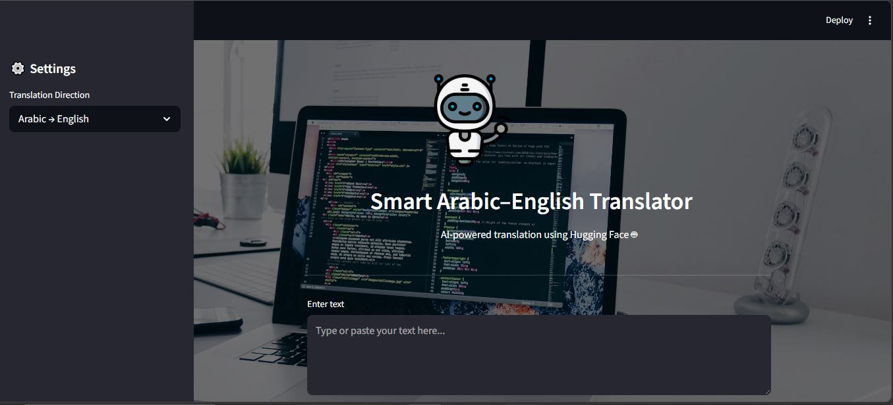

# 🌍🤖 Smart Arabic–English Translator

> **An AI-powered neural machine translation web application for translating text between Arabic and English using Hugging Face Transformers and Streamlit.**

[](https://www.python.org/)
[](https://huggingface.co/)
[](https://streamlit.io/)
[](https://en.wikipedia.org/wiki/Machine_translation)

---

## 📌 Overview

**Smart Arabic–English Translator** is an AI-powered Natural Language Processing (NLP) web application designed to translate text between **Arabic and English**.

The application uses pretrained **MarianMT neural machine translation models** from the Hugging Face ecosystem. A simple and interactive **Streamlit interface** allows users to enter text, select the translation direction, and obtain translated output in real time.

The project follows a modular architecture in which the **translation logic is separated from the user interface**, making the application easier to maintain, extend, and reuse.

---

## 🎯 Objectives

The main objectives of this project are to:

* Develop an AI-based Arabic–English translation system.
* Implement neural machine translation using pretrained Transformer models.
* Provide bidirectional translation between Arabic and English.
* Build an intuitive and interactive web interface.
* Separate translation logic from application presentation.
* Allow users to download translated text.
* Provide a lightweight solution for experimenting with multilingual NLP.

---

## ✨ Features

* 🔁 **Arabic ↔ English Translation**
* 🤖 **Hugging Face MarianMT Models**
* 🌐 **Bidirectional Translation**
* 🎨 **Interactive Streamlit Interface**
* 🖼️ **Dynamic Background Images**
* ⚡ **Fast and Lightweight Application**
* 📥 **Download Translated Text**
* 🧹 **Clear Input Option**
* 🧩 **Modular Project Architecture**
* 🧠 **Transformer-based Neural Machine Translation**

---

## 🧠 How It Works

The application follows a simple translation pipeline:

```text
                 User Input
                     │
                     ▼
            ┌─────────────────┐
            │ Language /      │
            │ Direction       │
            │ Selection       │
            └────────┬────────┘
                     │
                     ▼
            ┌─────────────────┐
            │ Translator      │
            │ Module          │
            └────────┬────────┘
                     │
                     ▼
          ┌──────────────────────┐
          │ Hugging Face         │
          │ MarianMT Model       │
          └──────────┬───────────┘
                     │
                     ▼
             Translated Text
                     │
                     ▼
          ┌──────────────────────┐
          │ Display / Download   │
          │ Translation          │
          └──────────────────────┘
```

---

## ⚙️ Translation Workflow

### 1. User Input

The user enters text into the Streamlit interface.

For example:

```text
Arabic:
مرحبا، كيف حالك؟
```

---

### 2. Translation Direction

The user selects the desired translation direction:

```text
Arabic → English
```

or

```text
English → Arabic
```

---

### 3. Neural Machine Translation

The application loads the appropriate pretrained MarianMT model from Hugging Face and processes the input text.

The model generates the translated sentence using a neural machine translation approach.

---

### 4. Translation Output

The translated text is displayed directly in the web application.

Example:

```text
Input:
مرحبا، كيف حالك؟

Output:
Hello, how are you?
```

Users can then download the translated result.

---

# 🤖 Models Used

The project uses pretrained **MarianMT models** available through Hugging Face.

| Translation Direction      | Model                        |
| -------------------------- | ---------------------------- |
| 🇸🇦 Arabic → 🇬🇧 English | `Helsinki-NLP/opus-mt-ar-en` |
| 🇬🇧 English → 🇸🇦 Arabic | `Helsinki-NLP/opus-mt-en-ar` |

These models are specifically designed for neural machine translation between the corresponding language pairs.

---

## 🖥️ Web Application

The Streamlit application provides a clean interface for interacting with the translation system.

### Main Interface Features

* Text input area
* Translation direction selection
* Translation button
* Translated output
* Clear input functionality
* Download translated text
* Dynamic visual interface

---

## 📸 Application Screenshots

### Translator Interface



---

### Translation Result


---

## 🛠️ Technologies Used

| Technology                    | Purpose                             |
| ----------------------------- | ----------------------------------- |
| **Python**                    | Core programming language           |
| **Hugging Face Transformers** | NLP and model integration           |
| **MarianMT**                  | Neural machine translation          |
| **Streamlit**                 | Interactive web application         |
| **PyTorch**                   | Model inference and computation     |
| **HTML/CSS**                  | Interface customization             |
| **PIL**                       | Image handling, if used             |
| **Requests**                  | External resource handling, if used |

---

## 📂 Project Structure

```text
Smart-Arabic-English-Translator/
│
├── app.py
│   └── Streamlit user interface
│
├── translator.py
│   └── Translation logic and model handling
│
├── requirements.txt
│   └── Project dependencies
│
├── Screenshots/
│   ├── translator.JPG
│   └── translator 01.JPG
│
└── README.md
    └── Project documentation
```

---

## 🏗️ Modular Architecture

One of the key design decisions in this project is the separation of the application into two main components.

### `app.py`

Responsible for:

* Streamlit interface
* User interaction
* Input/output display
* Translation direction selection
* Download functionality
* UI customization

### `translator.py`

Responsible for:

* Loading translation models
* Processing input text
* Performing translation
* Returning translated output

This separation improves **code organization, maintainability, and reusability**.

---

# 🚀 Installation

## 1. Clone the Repository

```bash
git clone https://github.com/FatimaZulfiqarAli-123/smart-arabic-english-translator.git
```

Then navigate into the project directory:

```bash
cd smart-arabic-english-translator
```

> Replace the repository URL above with your actual GitHub repository URL if the repository name is different.

---

## 2. Create a Virtual Environment

### Windows

```bash
python -m venv venv
```

Activate it:

```bash
venv\Scripts\activate
```

### macOS / Linux

```bash
python3 -m venv venv
```

Activate it:

```bash
source venv/bin/activate
```

---

## 3. Install Dependencies

Install the required Python packages:

```bash
pip install -r requirements.txt
```

---

# ▶️ Run the Application

Start the Streamlit application using:

```bash
streamlit run app.py
```

After running the command, Streamlit will provide a local URL where the application can be accessed in your browser.

---

## 📥 Download Translation

After generating a translation, users can download the translated text directly from the application.

This makes the application useful not only for experimentation but also for saving and reusing translation results.

---

## 🌍 Supported Translation Directions

### 🇸🇦 Arabic → 🇬🇧 English

Uses:

```text
Helsinki-NLP/opus-mt-ar-en
```

Example:

```text
Input:
أحب تعلم اللغة الإنجليزية.

Output:
I love learning English.
```

### 🇬🇧 English → 🇸🇦 Arabic

Uses:

```text
Helsinki-NLP/opus-mt-en-ar
```

Example:

```text
Input:
Artificial intelligence is transforming the world.

Output:
الذكاء الاصطناعي يغير العالم.
```

---

## 💡 Applications

The translator can be used for:

* 🌐 Cross-language communication
* 📚 Language learning
* 📝 Text translation
* 🤖 NLP experimentation
* 🎓 Educational projects
* 🔬 Machine translation research
* 💬 Multilingual applications

---

## 🔮 Future Improvements

Several improvements could be explored in future versions:

* Support additional Arabic dialects.
* Add automatic language detection.
* Support more language pairs.
* Improve handling of long documents.
* Add translation history.
* Add batch translation for multiple texts.
* Provide alternative translation suggestions.
* Add BLEU and other translation evaluation metrics.
* Compare MarianMT with modern multilingual Transformer models.
* Explore Arabic-specific pretrained models.
* Deploy the application as a publicly accessible web service.
* Add GPU acceleration for faster inference.

---

## ⚠️ Limitations

Although pretrained neural translation models provide useful translations, machine translation can still face challenges with:

* Ambiguous words
* Cultural expressions
* Idioms
* Context-dependent meanings
* Informal language
* Very long or complex sentences
* Arabic linguistic variation

Translation quality may therefore vary depending on the input text and context.

---

## 🤝 Contribution

Contributions and suggestions are welcome.

To contribute:

1. Fork the repository.
2. Create a new branch.
3. Make your changes.
4. Commit your changes.
5. Open a pull request.

---

## 📜 License

This project is intended primarily for **educational and research purposes**.

Please refer to the licenses and usage terms of the pretrained models used in this project.

---

## 👩‍💻 Author

**Fatima Zulfiqar Ali**

Machine Learning & NLP Enthusiast

Interested in **Natural Language Processing, Artificial Intelligence, Machine Learning, and multilingual NLP systems**.

---

## ⭐ Acknowledgements

This project was developed using the **Hugging Face Transformers ecosystem** and pretrained **Helsinki-NLP MarianMT models** for neural machine translation.

If you find this project useful, consider giving the repository a ⭐.
